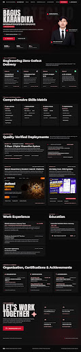

# Bagus Karandika — Professional Portfolio Website

Modern, dark-themed personal portfolio website for **Bagus Karandika** (Information Systems Graduate & Digital Solutions Specialist).



---

## 🌟 Highlights & Features

- **Striking Dark Aesthetic**: Curated crimson accent (`#c8102e`), ambient background glows, and Anton display typography.
- **Universal Multi-Column Layout**: Clean desktop and mobile layout with auto-scaling that preserves full-page grid architecture.
- **Interactive Dossiers & Modals**: Detailed project verification dossiers for E-Dispo, Smart Pesantren, and GS Baby Care POS.
- **Direct Curriculum Vitae Download**: One-click direct PDF download of authentic CV from navbar, hero, and contact section.
- **Contact Dossier & Toast Alerts**: Built-in contact form with interactive confirmation toast.

---

## 🛠️ Tech Stack

- **Markup**: Semantic HTML5
- **Styling**: Tailwind CSS & Custom CSS (`assets/css/style.css`)
- **Icons & Fonts**: Google Fonts (*Anton*, *Geist*, *Montserrat*), Material Symbols Outlined
- **Runtime Server**: Node.js static HTTP server (`server.js`)

---

## 🚀 How to Run Locally

1. **Clone the repository:**
   ```bash
   git clone https://github.com/karandika6-lab/Web-Portofolio.git
   cd Web-Portofolio
   ```

2. **Run with Node.js:**
   ```bash
   node server.js
   ```
   Open your browser and navigate to: [http://127.0.0.1:3000](http://127.0.0.1:3000)

3. **Or open directly:**
   Simply double-click `index.html` to open it in any modern web browser.

---

## 📄 License & Attribution

Designed and developed for **Bagus Karandika** • Lampung, Indonesia.
All rights reserved © 2026.
